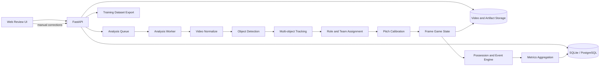

# Football Ana システム設計書 v2

更新日: 2026-09-20

## 1. 目的

フットサル、ソサイチ、サッカーの単眼試合動画から、選手・審判・ボールを検出して追跡し、チーム、ピッチ上の位置、ポゼッション、パス、シュート、移動距離を推定する。解析結果は動画と同期して確認・修正でき、修正内容を次回のモデル学習へ戻せることを目標とする。

本設計では、解析値をすべて確定値として扱わない。各検出・所属・イベントに信頼度と根拠を持たせ、低信頼度部分を人が修正できる構成にする。

## 2. 類似システムから採用する考え方

### SoccerNet Game State Reconstruction

SoccerNetは、映像から人物のピッチ座標、役割、チーム、背番号を復元する問題を、次の独立したサブタスクとして構成している。

- ピッチ検出とカメラキャリブレーション
- 人物検出、ReID、複数物体追跡
- 背番号認識
- チーム所属判定

本システムでも、`ally`と`opponent`をYOLOの固定物体クラスにはしない。YOLOは人物の役割を検出し、チームは追跡対象に付与する属性として扱う。

参考:

- https://www.soccer-net.org/tasks/game-state-reconstruction
- https://github.com/SoccerNet/sn-gamestate

### Roboflow Sports

Roboflow Sportsは、検出・追跡、ユニフォームや背番号による識別、ピッチ線を用いたカメラキャリブレーションを分離し、最終的に各フレームの実座標とイベントへ変換する構成を示している。

本システムでも画像ピクセル上の移動量を、そのままメートルへ変換しない。カメラキャリブレーション後のピッチ座標だけを、距離・速度・ヒートマップ計算に使用する。

参考:

- https://roboflow.com/ai/sports-analytics
- https://github.com/roboflow/sports

### Veo Analytics

Veoは、距離・速度などの追跡由来データと、パス・シュートなどのイベントデータを分けている。また、AIが検出したイベントは編集可能としている。

本システムも次の二種類を分離する。

- Physical metrics: 追跡座標から計算する距離、速度、出場時間
- Event metrics: ボール保持状態から推定するパス、シュート、ゴール候補

参考:

- https://support.veo.com/hc/en-us/articles/11873714080657-Veo-Analytics-2-Overview-and-features
- https://support.veo.com/hc/en-us/articles/50032070339217-Veo-Analytics-2-stats-glossary-what-each-stat-means

### Metrica Sports

Metrica Sportsは自動解析に加えて、フィールド位置や選手追跡を手動で補正する運用を提供している。本システムでも、自動キャリブレーションに失敗した場合は、ユーザーがピッチ上の対応点を指定できるようにする。

参考:

- https://www.metrica-sports.com/metrica-playbase

## 3. 現行実装の評価

### 継続利用する部分

- FastAPIによる動画アップロードと結果API
- OpenCVによる動画読み込み、フレーム取得、描画、動画出力
- Ultralytics YOLOによる人物・ボール検出
- PydanticによるAPI入出力定義
- HTML5 VideoとCanvasを重ねる表示方式
- 学習用フレーム抽出とYOLO仮ラベル生成

### 見直す部分

| 現状 | 問題 | v2設計 |
| --- | --- | --- |
| APIリクエスト内で同期解析 | 長い動画でタイムアウトする | ジョブキューとワーカーで非同期実行 |
| 中心点距離だけの簡易追跡 | 接近・交差でIDが入れ替わる | ByteTrackまたはBoT-SORTを採用 |
| 毎フレームの服色だけで所属判定 | 遮蔽時に敵味方が反転する | track単位の複数フレーム投票と手動確定 |
| `Ally/Opponent`を内部値に使用 | 視点や利用者で意味が変わる | 内部は`team_a/team_b`、表示時に味方を選択 |
| Canvasに架空の統計を描画 | 実解析結果と誤認される | 時刻付き解析JSONだけを描画 |
| フレーム数による仮パス加算 | パスの定義を満たさない | 保持者遷移とボール軌道からイベント推定 |
| ピクセル移動量で距離を扱う余地 | カメラ移動・遠近で誤差が大きい | ホモグラフィによるピッチ座標を使用 |
| JSONファイルだけで結果管理 | 修正履歴・検索・再解析が困難 | SQLiteから開始し、将来PostgreSQLへ移行 |
| 焼き込み動画が主出力 | 再解析や表示切替が重い | 元動画と時系列JSONを主出力、MP4は任意出力 |

## 4. 対象範囲

### v2で扱うもの

- 固定または緩やかに動く単眼カメラ映像
- フットサル、ソサイチ、サッカーの競技設定
- 選手、ゴールキーパー、審判、ボールの検出
- `team_a/team_b/official/unknown`の所属
- フレーム内の短中期追跡
- ピッチ座標、移動距離、速度、ヒートマップ
- ポゼッション区間、パス候補、シュート候補
- 動画同期表示と人による修正
- 修正結果から学習データを再生成する仕組み

### 初期段階で保証しないもの

- 画面外にいる選手の位置
- 背番号が見えない状態での個人名の完全自動特定
- 激しいカメラカットをまたぐ同一人物の完全なReID
- VAR相当のゴール・反則判定
- ボールが長時間隠れた場合の正確な軌道

## 5. 基本アーキテクチャ



### コンポーネント責務

| コンポーネント | 責務 |
| --- | --- |
| Web Review UI | アップロード、進捗、再生、オーバーレイ、イベント・所属・枠の修正 |
| FastAPI | 認証、試合・ジョブ・結果・修正API、成果物配信 |
| Analysis Worker | GPU/CPU解析パイプラインの実行と再実行 |
| Object Detector | `player/goalkeeper/referee/ball`のbboxと信頼度を生成 |
| Tracker | track ID、bbox、欠落状態、ReID特徴量を管理 |
| Team Assigner | ユニフォーム特徴をtrack単位で集約し、`team_a/team_b`を付与 |
| Pitch Calibrator | 画像座標から競技面座標への変換を管理 |
| Game State Builder | 時刻ごとの人物・ボール状態を共通形式へ統合 |
| Event Engine | 保持者、パス、シュートなどを状態遷移として推定 |
| Metrics Aggregator | 距離、速度、ポゼッション率、成功率などを集計 |
| Dataset Exporter | 人の修正をYOLO/MOT/分類データへ書き出す |

## 6. 解析パイプライン

### 6.1 取り込みと正規化

1. 動画を保存し、SHA-256で重複を確認する。
2. FFmpegまたはOpenCVでコーデック、FPS、回転、解像度を確認する。
3. 解析用タイムベースをミリ秒で統一する。
4. 競技種別、ピッチ寸法、前後半、攻撃方向、味方チームをユーザーが設定する。

競技プロファイル例:

```text
futsal   : 40m x 20m
society  : 会場ごとの入力値
football : 105m x 68mを初期値とし、実寸を入力可能
```

### 6.2 物体検出

検出クラスは役割に限定する。

```text
0 player
1 goalkeeper
2 referee
3 ball
```

敵・味方を物体クラスへ含めない。ボールは人物より小さく見逃しやすいため、別の信頼度閾値、入力解像度、学習評価を持つ。初期実装では1モデルでもよいが、将来は人物モデルとボールモデルを分離可能にする。

### 6.3 追跡

- 初期候補はByteTrack。遮蔽とカメラ移動が多い場合はBoT-SORTを比較する。
- trackは`track_id`、bbox履歴、検出信頼度、ReID特徴、所属確率を持つ。
- 所属は1フレームで反転させず、複数フレームの確率を集約する。
- 長い遮蔽後は新IDを許容し、人が同一人物として結合できるようにする。

### 6.4 チーム・個人識別

チームは次の順で決定する。

1. 人物bboxの胴体領域を抽出する。
2. 色特徴と画像埋め込みをtrack全体で集約する。
3. 2チームへクラスタリングする。
4. ユーザーが`team_a/team_b`の代表色と味方側を確認する。
5. 低信頼trackだけをレビュー対象にする。

個人名は自動断定せず、背番号OCR、登録ロスター、ユーザー確定を組み合わせる。保存上は`track_id`と`player_id`を分離する。

### 6.5 ピッチキャリブレーション

- ライン・交点・センターサークルなどからホモグラフィを推定する。
- 固定カメラでは1つの変換を利用する。
- パン・ズームがある場合は区間ごとに変換を推定し、時間方向に平滑化する。
- 自動推定できない場合、ユーザーが画像上の4点以上とピッチ上の対応点を指定する。
- キャリブレーション信頼度が不足する区間では、距離と速度を非表示または参考値にする。

### 6.6 ボール保持とイベント

選手とボールの単純な近さだけではパスとしない。次の状態機械を使用する。

```text
FREE
  -> CONTROLLED(team, track)  ボールが一定時間、選手の足元にある
  -> IN_FLIGHT                 保持者から離れ、速度が閾値を超える
  -> CONTROLLED(same team)    パス成功候補
  -> CONTROLLED(other team)   パス失敗・奪取候補
  -> SHOT_CANDIDATE           ゴール方向、高速度、ゴール領域への進入
  -> UNKNOWN                  ボール消失または信頼度不足
```

各イベントには開始・終了時刻、実行者、受け手、チーム、ピッチ座標、信頼度、根拠、修正状態を保存する。

### 6.7 指標計算

| 指標 | 計算条件 |
| --- | --- |
| 移動距離 | キャリブレーション済みtrackの平滑化された座標差分 |
| 速度 | 実座標差分 / 経過時間。異常値を除外 |
| ポゼッション | `CONTROLLED`区間のチーム別時間比率 |
| パス数 | 同チームの異なる保持者への遷移 |
| パス成功率 | 成功パス / パス試行。`UNKNOWN`は分母から除外または別表示 |
| シュート数 | `SHOT_CANDIDATE`を人が確認した数、または高信頼候補数 |
| ヒートマップ | ピッチ座標を時間加重で集約 |

解析結果には`estimated`、`reviewed`、`confirmed`の状態を表示し、推定値と確定値を区別する。

## 7. データモデル

### 主要エンティティ

```text
Match
  id, sport_type, title, pitch_width_m, pitch_height_m,
  ally_team_id, period_config, created_at

VideoAsset
  id, match_id, path, checksum, duration_ms, fps,
  width, height, codec

AnalysisJob
  id, match_id, pipeline_version, model_versions,
  status, progress, stage, error, started_at, completed_at

Detection
  job_id, frame_index, timestamp_ms, class_name,
  bbox_xyxy, confidence

TrackPoint
  job_id, track_id, frame_index, timestamp_ms,
  bbox_xyxy, image_anchor_xy, pitch_xy_m,
  detection_confidence, tracking_confidence

Track
  job_id, track_id, role, team_id, player_id,
  team_confidence, identity_confidence

CalibrationSegment
  job_id, start_ms, end_ms, homography,
  method, confidence, reprojection_error

PossessionSegment
  job_id, start_ms, end_ms, team_id, track_id,
  confidence, review_status

Event
  id, job_id, type, start_ms, end_ms,
  team_id, actor_track_id, target_track_id,
  pitch_xy_m, confidence, review_status, evidence

Correction
  id, entity_type, entity_id, before_json, after_json,
  user_id, reason, created_at
```

時系列データは内部ではJSONLまたはParquet成果物として保存し、検索・修正に必要な要約とイベントをDBへ保存する。すべてを巨大なJSONレスポンスにはしない。

## 8. API設計

```text
POST   /api/matches
POST   /api/matches/{match_id}/videos
POST   /api/matches/{match_id}/analysis-jobs
GET    /api/analysis-jobs/{job_id}
POST   /api/analysis-jobs/{job_id}/cancel

GET    /api/matches/{match_id}/summary
GET    /api/matches/{match_id}/timeline?from_ms=&to_ms=
GET    /api/matches/{match_id}/tracks?from_ms=&to_ms=
GET    /api/matches/{match_id}/events
GET    /api/matches/{match_id}/overlay.mp4

PATCH  /api/tracks/{track_id}
POST   /api/tracks/merge
PATCH  /api/events/{event_id}
POST   /api/events
DELETE /api/events/{event_id}
PUT    /api/matches/{match_id}/calibration

POST   /api/datasets/exports
GET    /api/models
POST   /api/models/evaluations
```

ジョブ状態:

```text
queued -> preprocessing -> detecting -> tracking -> calibrating
       -> events -> aggregating -> completed
       -> failed / canceled
```

進捗は初期段階ではポーリング、将来はWebSocketまたはServer-Sent Eventsで配信する。

## 9. Web画面設計

最初の画面を解析作業画面とし、宣伝用ランディングページにはしない。

### 試合設定

- 動画選択
- 競技種別とピッチ寸法
- 前後半と攻撃方向
- Team A / Team Bの代表色
- どちらを味方表示にするか
- ロスターと背番号（任意）

### 解析レビュー

- 中央: 動画とCanvasオーバーレイ
- 下部: 検出欠落・イベント・低信頼区間を示すタイムライン
- 右側: 選択中のtrackまたはイベントの属性編集
- 表示切替: bbox、ID、軌跡、ボール、ピッチレーダー、イベント
- コマンド: チーム変更、track結合・分割、イベント追加・削除、枠修正

CanvasはAPIの`timestamp_ms`付き結果を動画の`currentTime`へ同期して描画する。デモ用の架空座標や時間依存の架空統計は本番モードで使用しない。

### サマリ

- Team A / Team Bのポゼッション、パス、シュート
- 選手ごとの距離、速度、出場時間、ヒートマップ
- イベントを選択すると該当時刻へ移動
- 未確認数と低信頼件数を常に表示
- CSV/JSONとオーバーレイ動画を出力

## 10. 学習データ設計

### データセットを分ける

| データセット | ラベル |
| --- | --- |
| Object Detection | player, goalkeeper, referee, ballのbbox |
| Multi-object Tracking | frameごとのbboxと同一track ID |
| Team Classification | 胴体cropとteam_a/team_b/official/unknown |
| Pitch Calibration | ピッチの線、交点、ランドマーク |
| Event Detection | 保持区間、パス、シュートの時刻と関係track |

同じ動画の近接フレームをtrainとvalへランダム分割しない。試合単位、会場単位、カメラ単位で分割し、未知環境への性能を測定する。

### Active Learning

1. 既存モデルで仮ラベルを生成する。
2. 低信頼、遮蔽、密集、遠距離、ボール消失フレームを優先抽出する。
3. 人が枠・track・チーム・イベントを修正する。
4. 修正データを新しいdataset versionへ固定する。
5. 学習・評価し、基準を満たすモデルだけを採用する。
6. モデル名、重み、dataset version、評価値を記録する。

## 11. 評価指標と品質ゲート

| 対象 | 指標 | 初期品質ゲート案 |
| --- | --- | --- |
| 人物検出 | mAP50-95、Recall | ベースライン測定後に設定 |
| ボール検出 | Recall、Precision | Recallを優先し誤検出を後段で除去 |
| 追跡 | HOTA、IDF1、ID switch数 | 接近・交差クリップを別評価 |
| チーム分類 | track単位Accuracy | 95%以上を目標、unknownを許容 |
| キャリブレーション | 対応点の実座標誤差 | 誤差閾値超過区間は距離非表示 |
| パス・シュート | Precision、Recall、F1 | 競技別に評価 |
| システム | 処理時間、失敗率、再実行性 | 解析段階とエラーをUI表示 |

推定値の品質ゲートを満たさない場合、数値を無理に表示せず`解析不能`または`要確認`とする。

## 12. 実装ロードマップ

### Phase 1: 信頼できる検出・追跡基盤

- 現在の簡易`TeamStabilizer`をByteTrack/BoT-SORTへ置換
- frame単位の検出・track結果をJSONLへ保存
- 実解析結果をCanvasへ同期表示
- `team_a/team_b/unknown`へ内部表現を変更
- 枠、track、チームを修正するレビューUI

完了条件: 接近してもIDとチームが維持され、修正結果が保存される。

### Phase 2: ピッチ座標とPhysical metrics

- 競技プロファイルとピッチ寸法
- 手動4点キャリブレーション
- 固定カメラ向けホモグラフィ
- 距離、速度、ヒートマップ

完了条件: 既知距離を使った誤差評価を行い、信頼度不足区間を除外できる。

### Phase 3: ボール保持とイベント

- ボール専用データの追加学習
- 保持状態機械
- パス、奪取、シュート候補
- イベント編集UIと再集計

完了条件: 手動正解イベントに対するPrecision/Recallを表示できる。

### Phase 4: 個人識別と運用

- ロスター、背番号、player ID割当
- 非同期ワーカーとジョブ再実行
- モデル・データセットのバージョン管理
- 認証、権限、監査ログ
- レスポンシブWebをPWA化し、必要性を確認後にネイティブアプリ化

## 13. 直近の実装判断

次に着手する順番は以下とする。

1. 架空のCanvas統計を解析JSON描画へ置換する。
2. ByteTrackを導入し、`track_id`を永続化する。
3. チーム所属をtrack属性へ移し、`unknown`を追加する。
4. レビューUIでチーム変更とtrack結合を可能にする。
5. 手動ピッチキャリブレーションを追加する。
6. 距離計算後にポゼッション・パス推定へ進む。

この順序により、誤ったtrackや座標に基づく統計値を先に増やすことを避け、各段階を個別に評価できる。

## 14. 著作権とライセンス方針

- 類似製品の画面、文章、画像、ソースコードを複製しない。
- 公開情報から参照するのは、一般的な解析工程、評価方法、ユーザー課題に限定する。
- OSSはパッケージの公開APIとして利用し、コードをvendoringする場合は著作権表示とライセンス本文を保持する。
- 動画、アノテーション、モデル重みは、ソフトウェアとは別に出典と利用条件を記録する。
- 依存ライブラリの詳細は[THIRD_PARTY_NOTICES.md](../THIRD_PARTY_NOTICES.md)で管理する。

特に現在利用しているUltralyticsは、公式にAGPL-3.0と商用ライセンスの選択肢を示している。非公開・商用・SaaS・スマートフォン製品として提供する前に、採用ライセンスを確定するか、別の推論基盤へ置換する。
